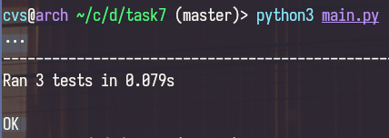

# Task & for Distributed Lab cryptograhy course
## Task goal:
##### Writing a wrapper for easy use of a library that works with algebra on elliptic curves
### Program execution example:
```sh
python3 main.py
```
### Output:

